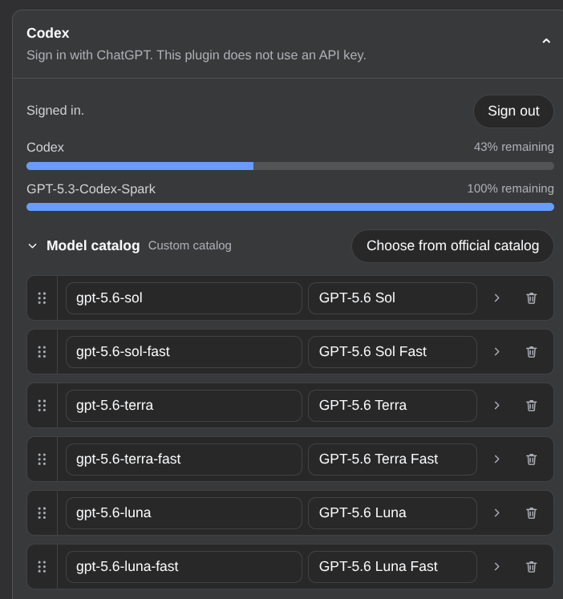
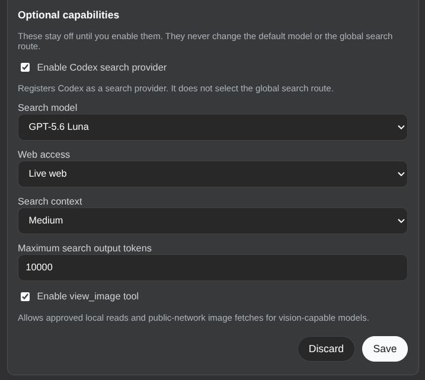

# dsh-llm-codex

[English](README.md) | 中文

DeepSeek Harness 的 ChatGPT Codex 集成。独立提供方路由是 `codex`，设置命名空间是 `llm-codex`。不声明 `apiKeyEnv`，不读写 `~/.codex/auth.json`，也不和 `dsh-codex-connect` 共用凭据文件。

包根导出 Cordis 插件契约。同一产物还导出 `./client`，在「设置 → 插件 → 插件配置」里贡献 Codex 卡片。

## 安装

需要 DeepSeek Harness 0.1.0-rc.6 或更新版本。可直接从 GitHub 安装：

~~~sh
dsh plugin --profile web add github:NOirBRight/dsh-llm-codex
dsh web
~~~

仓库跟踪已构建的 `lib` 产物，GitHub 安装不需要放开 build script。源码检出则先 `pnpm run build`，再做 link 安装。

## Web 配置

打开「设置 → 插件 → 插件配置 → Codex」。**用 ChatGPT 登录**会走官方 ChatGPT OAuth，弹出窗口，并把会话只存在 Host 的 `$DSH_HOME/codex-oauth.json`（权限 `0600`）。登录后卡片显示额度。退出登录会删除该文件。浏览器永远收不到 token。

### 模型目录

对话选择器只用 `settings.models` 这份显示目录。默认 6 行：

- `gpt-5.6-sol` / `gpt-5.6-sol-fast`
- `gpt-5.6-terra` / `gpt-5.6-terra-fast`
- `gpt-5.6-luna` / `gpt-5.6-luna-fast`

Fast 是独立的选择器行，不是复选框，也不是全局开关。模型目录和每行详情默认折叠。聊天仍使用官方 wire id；Fast 行会在 Codex Responses 请求上发送 `service_tier: "priority"`。覆盖层选择器可以再加入官方目录其余模型（`gpt-5.5`、`gpt-5.4`、`gpt-5.4-mini`、`gpt-5.3-codex-spark`，以及支持 Fast 的对应行）。也可以手动添加自定义 id。

聊天走 pi-ai `openai-codex-responses`，目标是 `https://chatgpt.com/backend-api`。未登录聊天会失败为 `MISSING_CREDENTIAL`。已存会话刷新失败则报 `AUTH`。

### 可选能力

搜索和 `view_image` 都实现了，但默认关闭。勾选后点保存会立刻注册或卸载，无需重启。打开搜索会注册独立的 Codex `WebSearchProvider`（`POST /codex/alpha/search`）。**不会**写入 `web.searchProvider` 或 `agent-default-model`。搜索模型是官方非 Fast 模型的下拉框，默认 `gpt-5.6-luna`。本插件还会注册 `web/openai-codex-search-llm-request`，以便卸载 `dsh-codex-connect` 后仍能打开它写下的会话日志。搜索模式与官方 Codex 一致：

- `cached`（默认）：只用 OpenAI 维护的索引，不抓当前页面
- `indexed`：仅当搜索索引放行时才 live fetch
- `live`：无限制实时抓取

`view_image` 是模型调用的工具，可读本地文件和公网 HTTP(S) 图片。Spark 只有文本。

## 配置

~~~yaml
- id: llm-codex
  name: 'dsh-llm-codex'
  config:
    enableSearch: false
    enableImageTool: false
    streamIdleTimeoutMs: 300000
    retryPolicy:
      mode: normal
      backoff:
        initialDelayMs: 500
        maxDelayMs: 10000
        jitterRatio: 0.1
~~~

没有 `apiKeyEnv`，也没有用户可改的 base URL。`models` 是显示在对话选择器里的目录。

## 许可证

MIT
